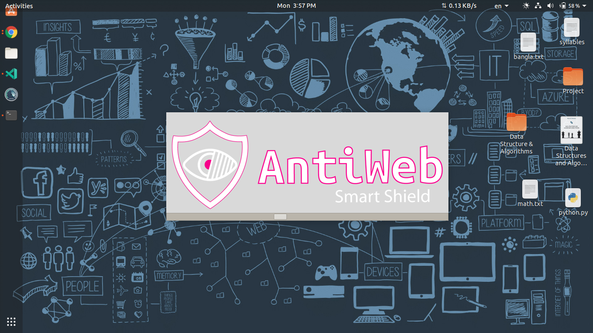

# AntiWeb

## Overview
AntiWeb is a Python GUI application developed during my studies in Python programming for the "Programming Essentials" course (subject code: 66631) as part of my engineering diploma. Tailored for Windows users, AntiWeb facilitates seamless management of website access. The application includes features like account creation, secure login, and an intuitive shield activation mechanism that efficiently blocks specified websites by updating the host file.
